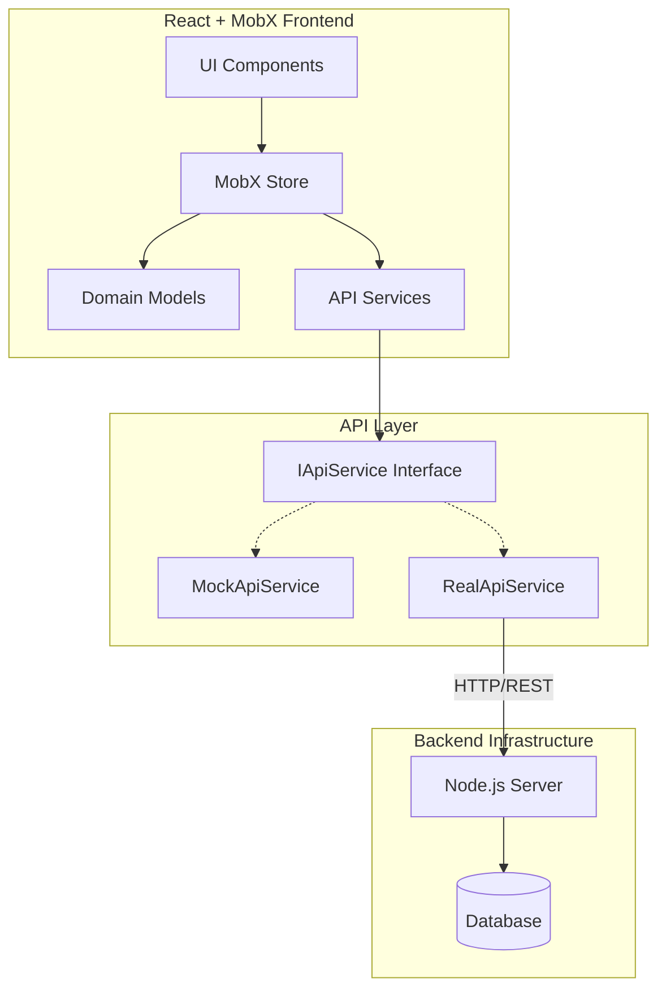

# Project Management Tool

This is a comprehensive project management application built with **React**, **Vite**, and **MobX**. It features task tracking, time management (timeboxing), drag-and-drop organization, and analytics.

## 🗂 System Structure & Architecture



The application is structured to separate data logic (models) from UI presentation (components).

### Directory Structure

- **`src/components`**: Contains all React components, organized by feature.
  - **`Gantt/`**: Kanban board and Task Card views.
  - **`Sidebar/`**: Navigation and project/group lists.
  - **`Calendar/`** (in `Gantt` or root): Calendar and Timeboxing views.
  - **`TaskDetails/`**: Modal for editing task details.
  - **`Timer/`**: Task timer functionality.
  - **`Settings/`**: Application settings modal.
- **`src/models`**: Contains the state management logic and data interfaces.
  - **`core.ts`**: Defines the fundamental TypeScript interfaces and classes (`Task`, `Group`, `Subtask`).
  - **`store.ts`**: The main **MobX** store (`ProjectStore`) that acts as the single source of truth for the application state.
- **`src/services`**: API and data fetching services.
- **`src/hooks`**: Custom React hooks.

### State Management (MobX)

The application uses **MobX** for state management, providing a reactive and observable state.

- **`ProjectStore`** (`src/models/store.ts`): The root store.
  - Manages **Groups** and **Tasks**.
  - Handles **UI State** (view modes, sidebar visibility, modals).
  - Manages **Timer** state (running, paused, elapsed time).
  - Handles **Data Persistence** (local storage and API synchronization).

---

## 💾 Data Models

The core data entities are defined in `src/models/core.ts`.

### 1. Task (`ITask`)
The fundamental unit of work.
- **`id`**: Unique identifier (UUID).
- **`title`**: Task name.
- **`status`**: Current state (`todo`, `in-progress`, `done`).
- **`description`**: Detailed text content.
- **`subtasks`**: Array of `ISubtask` items.
- **`scheduledDate`**: Date assigned for the task (for Calendar/Timeboxing).
- **`scheduledTime`**: Specific time block (e.g., "14:00").
- **`duration`**: Estimated time in minutes.
- **`actualDuration`**: Actual recorded time.
- **`labels`**: Array of label IDs.
- **`participants`**: Users assigned to the task.

### 2. Group (`IGroup`)
Represents a collection of tasks (equivalent to a Project or a Column).
- **`id`**: Unique identifier.
- **`name`**: Display name of the group.
- **`tasks`**: Array of `Task` objects belonging to this group.
- **`participants`**: Users assigned to this group.

### 3. Subtask (`ISubtask`)
A small checklist item within a Task.
- **`id`**: Unique identifier.
- **`title`**: Text content.
- **`isCompleted`**: Boolean status.

### 4. Label (`ILabel`)
Tags for categorizing tasks.
- **`id`**, **`name`**, **`color`**.

---

## 🚀 Getting Started

This project is built with React + Vite.

### Prerequisites
- Node.js (v18+ recommended)
- npm or yarn

### Installation

```bash
npm install
```

### Development

To start the development server:

```bash
npm run dev
```

### Build

To build for production:

```bash
npm run build
```

---

## 🛠 Tech Stack

- **Framework**: React 19
- **Build Tool**: Vite
- **State Management**: MobX
- **Drag & Drop**: @dnd-kit
- **Styling**: CSS (Modules/Global) + Tailwind (if configured)
- **Icons**: Lucide React
- **Dates**: date-fns
